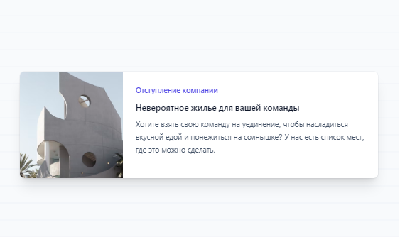
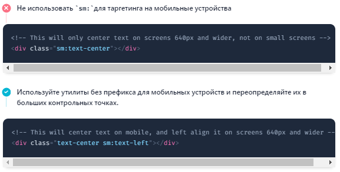
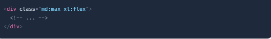
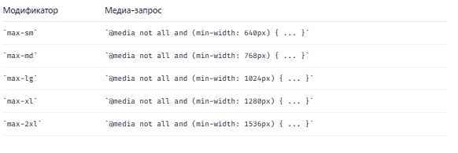
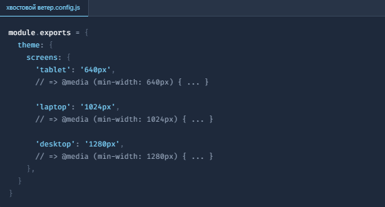

# tailwindreact

# Начало работы с Tailwind CSS

Tailwind CSS работает, сканируя все ваши HTML-файлы, компоненты JavaScript и любые другие шаблоны на наличие имен классов, создавая соответствующие стили и затем записывая их в статический файл CSS.

Это быстро, гибко и надежно — с нулевым временем выполнения.

# Отзывчивый дизайн

Использование адаптивных вариантов утилит для создания адаптивных пользовательских интерфейсов.

Обзор
Каждый служебный класс в Tailwind можно применять условно в разных точках останова, что упрощает создание сложных адаптивных интерфейсов, даже не выходя из HTML-кода.

По умолчанию существует пять точек останова, основанных на распространенных разрешениях устройств:

Префикс точки останова Минимальная ширина CSS
sm 640 пикселей @media (min-width: 640px) { ... }
md 768 пикселей @media (min-width: 768px) { ... }
lg 1024 пикселей @media (min-width: 1024px) { ... }
xl 1280 пикселей @media (min-width: 1280px) { ... }
2xl 1536 пикселей @media (min-width: 1536px) { ... }
Чтобы добавить утилиту, но чтобы она вступала в силу только в определенной точке останова, все, что вам нужно сделать, это указать перед утилитой имя точки останова, за которым следует символ

Чтобы добавить утилиту, но чтобы она вступала в силу только в определенной точке останова, все, что вам нужно сделать, это указать перед утилитой имя точки останова, за которым следует символ ::

<!-- Width of 16 by default, 32 on medium screens, and 48 on large screens -->

Это работает для каждого служебного класса в фреймворке , что означает, что вы можете изменить буквально что угодно в заданной точке останова — даже такие вещи, как расстояние между буквами или стили курсора.

Вот простой пример компонента маркетинговой страницы, в котором на маленьких экранах используется стековый макет, а на больших экранах — параллельный макет (измените размер окна браузера, чтобы увидеть его в действии) :

  

    

      
    

    

      
Company retreats

      <a href="#" class="block mt-1 text-lg leading-tight font-medium text-black hover:underline">Incredible accommodation for your team</a>
      
Looking to take your team away on a retreat to enjoy awesome food and take in some sunshine? We have a list of places to do just that.

    

  

Вот как работает приведенный выше пример:

По умолчанию внешний divстоит display: block, но добавлением md:flexутилиты он становится display: flexна средних экранах и больше.
Когда родителем является гибкий контейнер, мы хотим убедиться, что изображение никогда не сжимается, поэтому мы добавили, md:shrink-0чтобы предотвратить сжатие на средних и больших экранах. Технически мы могли бы просто использовать его shrink-0, так как он ничего не делает на небольших экранах, но поскольку это имеет значение только на mdэкранах, было бы неплохо указать это в имени класса.
На маленьких экранах изображение автоматически становится полноразмерным по умолчанию. На средних экранах и выше мы ограничили ширину фиксированным размером и обеспечили полную высоту изображения с помощью md:h-full md:w-48.
В этом примере мы использовали только одну точку останова, но вы можете легко настроить этот компонент для других размеров, используя также префиксы sm, lg, xl, или адаптивные.2xl

# Мобильная версия

По умолчанию Tailwind использует систему точек останова для мобильных устройств, аналогичную той, к которой вы могли привыкнуть в других фреймворках, таких как Bootstrap.

Это означает, что утилиты без префикса (такие как uppercase) действуют на всех размерах экрана, в то время как утилиты с префиксом (такие как md:uppercase) действуют только в указанной точке останова и выше .

​

# Таргетинг на мобильные экраны

Этот подход чаще всего удивляет людей тем, что для оформления чего-то для мобильных устройств вам нужно использовать версию утилиты без префикса, а не sm:версию с префиксом. Не думайте об этом sm:как о значении «на маленьких экранах», думайте об этом как о «на маленькой точке останова ».

По этой причине часто рекомендуется сначала реализовать макет для мобильных устройств, а затем вносить любые изменения, которые имеют смысл для smэкранов, а затем mdэкраны и т. д.

Oриентация на диапазон точек останова
По умолчанию стили, применяемые по таким правилам, md:flexбудут применяться в этой точке останова и останутся примененными в более крупных точках останова.

Если вы хотите применять утилиту только тогда, когда активен определенный диапазон точек останова, сложите адаптивный модификатор, например, mdс max-\*модификатором, чтобы ограничить этот стиль определенным диапазоном:

Tailwind генерирует соответствующий max-\*модификатор для каждой точки останова, поэтому из коробки доступны следующие модификаторы:

# Настройка вашей темы
Вы можете полностью настроить точки останова в tailwind.config.jsфайле:
